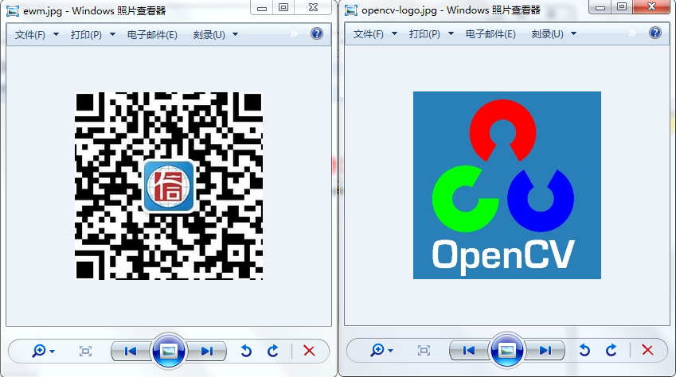

## OpenCV操作

### 读取图片

第一步是读取图片，OpenCV可以通过`cv2.inread()`方法来读取。且第二个参数可以指定3种读取方式：

```python
import cv2

# cv2.IMREAD_COLOR，以彩色图片方式加载，忽略透明度信息；此为默认的方式
img = cv2.imread('../sources/IMG_20171011_173400.jpg', cv2.IMREAD_COLOR)
# or
img = cv2.imread('../sources/IMG_20171011_173400.jpg', 1)

# cv2.IMREAD_GRAYSCALE，以灰度模式加载图片，会忽略色彩和透明度信息
img = cv2.imread('../sources/IMG_20171011_173400.jpg', cv2.IMREAD_GRAYSCALE)
# or
img = cv2.imread('../sources/IMG_20171011_173400.jpg', 0)

# cv2.IMREAD_UNCHANGED，包括alpha通道信息的加载图片(即透明度信息)
img = cv2.imread('../sources/IMG_20171011_173400.jpg', cv2.IMREAD_UNCHANGED)
# or
img = cv2.imread('../sources/IMG_20171011_173400.jpg', -1)
```

Ps.
有个事情要说一下，就是这货如果你填的图片不存在，或者你填错名称了，它不会有任何反应，不会报错，直接返回一个None。

### 展示图片

显示图像，我们使用`cv2.imshow()`方法，该方法会使用本地窗口展示一个图片，并自动适应该图片的大小。

接收两个参数，第一个是窗口名称，第二个就是我们需要展示的图片对象。

*我们可以创建多个展示窗口，但是不能重名*

```python
cv2.imshow('image', img)
cv2.waitKey(0)
cv2.destroyAllWindows()
```

备注：  
上面示例中的`cv2.waitKey(0)`是一个键盘事物绑定函数，具体我们后面再研究；  
`cv2.destroyAllWindows()`是将所有开启的窗口均销毁，如果想要关闭指定的窗口，可以传入窗口名称的参数。

同理，在调用`cv2.imshow()`之前，可以定义一个窗体，并设置指定窗口是否可调整大小，使用的是`cv2.namedWindow()`方法，它也接收两个参数，第一个是窗口名称；第二个是标志，`cv2.WINDOW_AUTOSIZE`是默认的，它表示窗口适应图片，且窗口大小不可自定义调整，如果你想要可以调整的窗口，那么可以指定`cv2.WINDOW_NORMAL`标志：

*如果你调整了窗体，那么展示的图片也会跟着拉伸*

```python
cv2.namedWindow('image', cv2.WINDOW_NORMAL)
cv2.imshow('image', img)
cv2.waitKey(0)
cv2.destroyAllWindows()
```

备注：  
上面示例中的`cv2.namedWindow()`和`cv2.imshow()`中的窗体名称需要保持一致，如果不一样，那么就相当于创建了两个窗口，并且第一个是一个空的窗体，第二个是默认的窗体。

如果有安装Matplotlib，那么也可以使用它来展示图像，我们这里仅示例，后续再深入探讨

```python
from matplotlib import pyplot as plt

plt.inshow(img, camp='gray', interpolation='bicubic')
plt.xticks([]), plt.yticks([]) # to hide tick values on X and Y aixs
plt.show()
```

### 写入图片

写入图片，即储存图片，我们使用`cv2.imwrite()`即可，该方法第一个参数是文件名称，第二个参数是需要存储的图片对象，如

```python
cv2.imwrite('messigray.png', img)
```

*上述命令会将`img`以PNG格式存储在当前目录，且文件名称为`messigray.png`。*

### 将读、展示、写图片串起来

下面示例是一个官方文档中的示例，用来读取一个图片，展示它，且当你按`s`键时，会保存图片，而按`Esc`时，不会保存直接退出

```python
import numpy as np
import cv2

img = cv2.imread('messi5.jpg',0)
cv2.imshow('image',img)
k = cv2.waitKey(0)
if k == 27:         # wait for ESC key to exit
    cv2.destroyAllWindows()
elif k == ord('s'): # wait for 's' key to save and exit
    cv2.imwrite('messigray.png',img)
    cv2.destroyAllWindows()
```

### 对图像的基本操作

OpenCV还有更多，比如从摄像机捕捉图像、操作视频、画图、笔刷、调色板等等。  
由于与本项目暂时没有什么关联，我们先不探究，后续再系统研究。

我们现在来看看如何操作图像，主要有以下几点：

- 访问和修改像素的值
- 访问图片的属性
- 设置图像的区域
- 拆分和合并图片

*本章节几乎都是基于Numpy，而不是OpenCV；所以了解Numpy能更好的使用OpenCV写出代码。*

#### 访问和修改像素的值

我们先加载彩色的图片(即默认的标志就可以了)

```python
>>> import cv2
>>> import numpy
>>> img = cv2.imread('../sources/IMG_20171011_173400.jpg')
```

我们可以通过行列的坐标，来访问像素值

```python
>>> px = img[100, 100]
```

对于BGR图像来说，它会返回一个蓝色、绿色、红色的值的数组，如

```python
>>> print px
[178 162 150]
```

而对于灰度图像来说，它返回的是相应的强度值

```python
>>> print px
160
```

所以，至此我们就能推出，是不是可以这样来修改像素值呢？

答案是当然可以，如

```python
>>> img[100, 100] = [255, 255, 255]
>>> print img[100, 100]
[255 255 255]
```

*但是我们不鼓励简单的访问每个像素然后进行修改，而应该用快速阵列计算的优化库Numpy来做。*

更好的一个像素访问/修改方法是使用`item`，如下

```python
# 访问坐标10,10像素的红色值
>>> img.item(10, 10, 2)
147

# 修改该像素点红色的值为90
>>> img.itemset((10, 10, 2), 90)
>>> img.item(10, 10, 2)
90
```

#### 访问图片的属性

图像的属性包括有行数、列数、通道值、图像数据类型、像素数等等。

访问图像的形状数据，可以通过`shape`属性，

如果是彩色图像，那么它返回一个像素行、像素列、通道的元组；

如果是灰度图像，那么仅返回一个像素行、像素列的元组。

```python
>>> img.shape
(2976, 3968, 3)
>>> imggray.shape
(2976, 3968)
```

*Ps. 利用灰度图像只返回行列两个数的特性，可以利用该属性来判断加载的是彩色图像还是灰度图像！*

总共的像素数可以通过`size`属性访问

```python
>>> img.size
35426304
>>> imggray.size
11808768
```

*Ps. 2976*3968=11808768，那为什么彩色的图像就显示那么多呢？因为3通道啊...（11808768*3=35426304）*

图像的数据类型可以通过`dtype`属性访问

```python
>>> img.dtype
dtype('uint8')
>>> imggray.dtype
dtype('uint8')
```

*Ps. `uint8`就是8位无符号int整数，可以表示的值范围为0~255，即我们常见的RGB值的范围*

*更多请参考：*

*https://docs.scipy.org/doc/numpy/user/basics.types.html*

*http://www.cnblogs.com/denny402/p/5122328.html*


**`img.dtype`在调试时非常重要，因为OpenCV-Python代码中的大量错误是由无效数据类型引起的。**

#### 图像的区域

ROI（Region Of Image）

有时候，我们必须操作某些确定区域的图像。 假设检测图像中的眼睛，我们首先对图像执行脸部检测，找到脸部之后，再在脸部区域内搜索眼睛。这种方法提高了准确性（因为眼睛总是在脸上:D）和表现（因为我们搜索一个小区域）。

ROI仍然遵循Numpy的索引切片，如下，我们将图片中的一面国旗横向复制1000个像素到另一个点上

```python
>>> flag = img[646:1282, 2466:3046]
>>> img[646:1282, 1466:2046] = flag
```

*Ps. Numpy数组切片，可以这么理解：`646:1282`表示从646行到1282行，`2466:3046`表示从2466列到3046列。*

#### 拆分/合并图像的通道

当有需要的时候，一幅图的BGR通道可以拆分成单独的一面；当然，这些单独的通道也可以反过来组成一幅BGR的图，像如下表达：

```python
>>> b, g, r = cv2.split(img)
>>> img = cv2.merge((b, g, r))

# or
>>> b = img[:, :, 0]
```

现在，假设我们要将该图所有的红色像素通道全部置为0，不用先拆分，然后再置0，再合并；
我们可以直接使用Numpy索引来得更快，如

```python
>>> img[:, :, 2] = 0
```

*Ps. 从时间上来考虑，`cv2.split()`是消耗很大的，所以非到万不得已才使用，否则尽量使用Numpy indexing。*

#### 为图像制作边框（填充）

如果我们想要为图像制作一个边框，类似于相框这种，我们可以使用`cv2.copyMakeBorder()`方法。

但是它有更多的复杂运算、零填充等应用，它接收的参数如下：

- src: 输入的图像对象
- top, bottom, left, right: 相应边的像素宽度
- borderType: 用来定义需要添加什么类型的边的标志，可用值如下
     - cv2.BORDER_CONSTANT: 一个连续填充的边框，其值应该在下一个参数给出
     - cv2.BORDER_REFLECT: 会镜像映射边元素的边框，像这样: fedcba|abcdefgh|hgjedcb
     - cv2.BORDER_REPLICATE: 自始至终的复制最后一个边元素，像这样: aaaaaa|abcdefgh|hhhhhh
     - cv2.BORDER_WRAP: 解释不来了，会像这样: cdefgh|abcdefgh|abcdefg
- value: 如果borderType是`cv2.BORDER_CONSTANT`，那么这个参数是其填充颜色值

下面引用官方文档中的一个演示示例来说明各个类型的表现（因为是采用Matplotlib来展示的，图中的红色RED和蓝色BLUE会调换）

```python
import cv2
import numpy as np
from matplotlib import pyplot as plt

BLUE = [255,0,0]

img1 = cv2.imread('opencv_logo.png')

replicate = cv2.copyMakeBorder(img1,10,10,10,10,cv2.BORDER_REPLICATE)
reflect = cv2.copyMakeBorder(img1,10,10,10,10,cv2.BORDER_REFLECT)
reflect101 = cv2.copyMakeBorder(img1,10,10,10,10,cv2.BORDER_REFLECT_101)
wrap = cv2.copyMakeBorder(img1,10,10,10,10,cv2.BORDER_WRAP)
constant= cv2.copyMakeBorder(img1,10,10,10,10,cv2.BORDER_CONSTANT,value=BLUE)

plt.subplot(231),plt.imshow(img1,'gray'),plt.title('ORIGINAL')
plt.subplot(232),plt.imshow(replicate,'gray'),plt.title('REPLICATE')
plt.subplot(233),plt.imshow(reflect,'gray'),plt.title('REFLECT')
plt.subplot(234),plt.imshow(reflect101,'gray'),plt.title('REFLECT_101')
plt.subplot(235),plt.imshow(wrap,'gray'),plt.title('WRAP')
plt.subplot(236),plt.imshow(constant,'gray'),plt.title('CONSTANT')

plt.show()
```


### 图像的运算操作

#### 图像相加

我们可以通过OpenCV的`cv2.add()`方法，或者使用Numpy直接操作`res = img1 + img2`，这都要求两幅图有相同的大小、深度和通道。

虽然两种方法都能相加，但是两者是有不同的，OpenCV的方式是深度相加，而Numpy的相加是取余，如下所示：

```python
>>> x = np.uint8([250])
>>> y = np.uint8([10])

>>> print cv2.add(x, y)  # 250 + 10 = 260 => 255
[[255]]

>>> print x+y            # 250 + 10 = 260 % 256 => 4
[4]
```

直接通过两张相同大小和通道的图片来示例更加明显，如下两张截图，它们相加后，image1窗体所示是OpenCV的相加，image2窗体所示是Numpy的相加：




*由此可以看出，OpenCV的相加提供了更加好一些的结果，所以坚持使用OpenCV能更好。*

#### 图像的融合

这其实也是一种图像相加，只不过给每个图分配不同的比重，那么看上去就是融合或者透明了，图像会按照如下方程相加：


其中的  取值从0 --> 1，可以在两个图片之间做一个很酷的过渡。

OpenCV中的`cv2.addWeighted()`提供按如下方程相加：


我们来测试一下，看一下效果（此例中图片为上面的两张一样的图片，第一张占比0.7，第二张占比0.3，  给值0）

```python
>>> img1 = cv2.imread('../sources/opencv-logo.jpg', 1)
>>> img2 = cv2.imread('../sources/ewm.jpg', 1)

>>> dst = cv2.addWeighted(img1, 0.7, img2, 0.3, 0)
```

结果如下


#### 按位操作

按位操作包括与(And)、或(Or)、非(Not)和异或(XOR)。

我们使用如下示例来演示，将OpenCV的logo扣取出来覆盖到另一张图上，透明度信息等保持不变：

```python
#!/usr/bin/env python
# -*- coding: utf-8 -*-

import cv2
import numpy as np

# 加载两幅图片
img01 = cv2.imread('../sources/castle.jpg', 1)
#img02 = cv2.imread('../sources/opencv-logo.jpg', 1)
# 此图用背景为透明的来做方便一些，所以要用opencv-logo-white.png图片，自己截图的有蓝色背景
img02 = cv2.imread('../sources/opencv-logo-white.png', 1)

# 因为需要将logo置于左上角，所以根据img02的尺寸创建一个ROI
rows, cols, channels = img02.shape
roi = img01[0:rows, 0:cols]

# 现在创建一个logo的蒙版和它的反转蒙版
img02gray = cv2.cvtColor(img02, cv2.COLOR_BGR2GRAY)
ret, mask = cv2.threshold(img02gray, 10, 255, cv2.THRESH_BINARY)
mask_inv = cv2.bitwise_not(mask)

# 然后将logo中的ROI进行遮光
img01_bg = cv2.bitwise_and(roi, roi, mask=mask_inv)

# 仅从logo中取出logo部分
img02_bg = cv2.bitwise_and(img02, img02, mask=mask)

# 将logo放入ROI中，并且修改主图中相应区域
dst = cv2.add(img01_bg, img02_bg)
img01[0:rows, 0:cols] = dst

# 展示看效果
cv2.imshow('img01_bg', img01_bg)
cv2.imshow('img02_bg', img02_bg)
cv2.imshow('image', img01)
cv2.waitKey(0)
cv2.destroyAllWindows()
```

以下是分别展示的`img01_bg`、`img02_bg`和最终的`img01`结果图：


### 性能优化

接下来就是需要考虑性能问题了。

*Ps. 但是我们暂时先不考虑，实现再说。*

