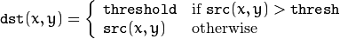

## OpenCV操作

因接下来需要学习到OpenCV中的数学操作工具了，比较重要，所以单独起一篇。

### 图像处理之改变色彩空间

在OpenCV中有150多个色彩空间转换的方法，我们这里只看其中两个应用最广泛的，即BGR<-->GRAY，BGR<-->HSV。

我们之前也用过这样的方法，如

```python
>>> img = cv2.imread('../sources/img_small.jpg')
>>> imgray = cv2.cvtColor(img, cv2.COLOR_BGR2GRAY)
```

色域转换我们使用`cv2.cvtColor(input_image, flag)`方法，其中`flag`的值取决于需要转换的类型。

如果是从BGR-->GRAY，则`flag`为`cv2.COLOR_BGR2GRAY`；  
同理，如果是从BGR-->HSV，则为`cv2.COLOR_BGR2HSV`。
  
要想知道还有其他的什么`flag`取值，可以按如下操作查看

```python
>>> import cv2
>>> flags = [i for i in dir(cv2) if i.startswith('COLOR_')
>>> print flags
```

#### 对象捕捉

现在我们可以从BGR转换到HSV色彩空间，来提取颜色对象。

因为在HSV中，表示颜色比在BGR色彩空间中表示颜色更容易，我们在下面例子中尝试提取一个黄色的对象（城堡）

```python
#!/usr/bin/env python
# -*- coding: utf-8 -*-

# 测试HSV来提取颜色对象

import cv2
import numpy as np

img = cv2.imread('../../sources/castle.jpg', 1)

img_hsv = cv2.cvtColor(img, cv2.COLOR_BGR2HSV)

lower_yellow = np.uint8([0, 50, 50])
upper_yellow = np.uint8([34, 255, 255])

mask = cv2.inRange(img_hsv, lower_yellow, upper_yellow)

res = cv2.bitwise_and(img, img, mask=mask)

cv2.imshow('img', img)
cv2.imshow('img_hsv', img_hsv)
cv2.imshow('mask', mask)
cv2.imshow('res', res)

cv2.waitKey(0)
cv2.destroyAllWindows()
```

结果如下：


*Ps. 当然，这样简单的抠出来不是很完美的，还有很多杂物，我们后续会继续看如何处理。*

**补充HSV色彩空间知识**

HSV(hue,saturation,value)颜色空间的模型对应于圆柱坐标系中的一个圆锥形子集，圆锥的顶面对应于V=1. 它包含RGB模型中的R=1，G=1，B=1 三个面，所代表的颜色较亮。

色彩H由绕V轴的旋转角给定。红色对应于 角度0° ，绿色对应于角度120°，蓝色对应于角度240°。在HSV颜色模型中，每一种颜色和它的补色相差180° 。

饱和度S取值从0到1，所以圆锥顶面的半径为１。

HSV颜色模型所代表的颜色域是CIE色度图的一个子集，这个 模型中饱和度为百分之百的颜色，其纯度一般小于百分之百。

在圆锥的顶点(即原点)处，V=0,H和S无定义， 代表黑色。圆锥的顶面中心处S=0，V=1,H无定义，代表白色。从该点到原点代表亮度渐暗的灰色，即具有不同 灰度的灰色。对于这些点，S=0,H的值无定义。可以说，HSV模型中的V轴对应于RGB颜色空间中的主对角线。 在圆锥顶面的圆周上的颜色，V=1，S=1,这种颜色是纯色。HSV模型对应于画家配色的方法。画家用改变色浓和 色深的方法从某种纯色获得不同色调的颜色，在一种纯色中加入白色以改变色浓，加入黑色以改变色深，同时 加入不同比例的白色，黑色即可获得各种不同的色调。


**RGB-->HSV**色彩模式值的转换方式如下：

```c
var_R = ( R / 255 ) //RGB from 0 to 255
var_G = ( G / 255 )
var_B = ( B / 255 )

var_Min = min( var_R, var_G, var_B ) //Min. value of RGB
var_Max = max( var_R, var_G, var_B ) //Max. value of RGB

del_Max = var_Max - var_Min //Delta RGB value

V = var_Max

if ( del_Max == 0 ) //This is a gray, no chroma...
{
    H = 0 //HSV results from 0 to 1
    S = 0
}
else //Chromatic data...
{
    S = del_Max / var_Max
   
    del_R = ( ( ( var_Max - var_R ) / 6 ) + ( del_Max / 2 ) ) / del_Max
    del_G = ( ( ( var_Max - var_G ) / 6 ) + ( del_Max / 2 ) ) / del_Max
    del_B = ( ( ( var_Max - var_B ) / 6 ) + ( del_Max / 2 ) ) / del_Max

    if ( var_R == var_Max ) H = del_B - del_G
    else if ( var_G == var_Max ) H = ( 1 / 3 ) + del_R - del_B
    else if ( var_B == var_Max ) H = ( 2 / 3 ) + del_G - del_R

    if ( H < 0 ) ; H += 1
    if ( H > 1 ) ; H -= 1
}
```

#### 如何找到需要跟踪的HSV值

我们大可不必使用上述步骤计算，上面只是列出来让我们了解一下即可。

实际上，我们仍然用`cv2.cvtColor()`方法即可找出需要的HSV值，只是我们传入的不是图像，而是一个BGR的值。

比如我们要找绿色的（Green），可以按照如下所示

```python
>>> green = np.uint8([[[0, 255, 0]]])
>>> hsv_green = cv2.cvtColor(green, cv2.COLOR_BGR2HSV)
>>> print hsv_green
[[[ 60 255 255]]]
```

其中，`hsv_green`就是绿色的值了，我们基本可以按照下限`[H - 10, 100, 100]`至上限`[H + 10, 255, 255]`这个作为范围了。当然，也可以使用图像编辑软件等来获取HSV的值，最后都要记得添加上一定的范围哦。

### 图像处理之图像阈值化/二值化

#### 简单阈值化

很简单，如果一个像素点高于一个阈值，我们给它定义一个值（可能是白色），否则，给它定义另一个值（可能是黑色）。

我们需要用的的方法是`cv2.threshold()`，它有四个参数

1. 原图（**必须要是灰度GRAY图像**）
2. 用来界定像素值的阈值
3. 当像素点值大于（有时候是小于）阈值时给的值
4. 阈值化的类型

其中第四个参数，在OpenCV中，提供如下几个不同的类型，以及它们的策略（dst是目标结果）

- `cv2.THRESH_BINARY`


- `cv2.THRESH_BINARY_INV`
    


- `cv2.THRESH_TRUNC`



- `cv2.THRESH_TOZERO`


- `cv2.THRESH_TOZERO_INV`


该方法会返回两个对象，第一个是`retval`，稍后再说；第二个`thresholded image`就是我们阈值化后的图像了。

下面使用一个例子来演示一下各个类型的阈值化的区别（来自官方文档）

```python
#!/usr/bin/env python
# -*- coding: utf-8 -*-

# 演示各个类型的的阈值化表现

import cv2
import numpy as np
from matplotlib import pyplot as plt

img_gray = cv2.imread('../../sources/gradient.jpg', 0)

ret, thresh1 = cv2.threshold(img_gray, 127, 255, cv2.THRESH_BINARY)
ret, thresh2 = cv2.threshold(img_gray, 127, 255, cv2.THRESH_BINARY_INV)
ret, thresh3 = cv2.threshold(img_gray, 127, 255, cv2.THRESH_TRUNC)
ret, thresh4 = cv2.threshold(img_gray, 127, 255, cv2.THRESH_TOZERO)
ret, thresh5 = cv2.threshold(img_gray, 127, 255, cv2.THRESH_TOZERO_INV)

titles = ['Original Image', 'BINARY', 'BINARY_INV', 'TRUNC', 'TOZERO', 'TOZERO_INV']
images = [img_gray, thresh1, thresh2, thresh3, thresh4, thresh5]

for i in xrange(6):
    plt.subplot(2, 3, i+1), plt.imshow(images[i], 'gray')
    plt.title(titles[i])
    plt.xticks([]), plt.yticks([])

plt.show()
```

运行结果如下，可以很明显看出各个类型的区别：


#### 自适应阈值化

上面我们是指定一个阈值，大于它就怎样，小于就怎样，那么对于光线不好的照片来说，就会出现如下这样的情况：

如果我们把阈值调小了，会有一部分图看不清，如果调大了，又会展示不全（左边v=50, 右边v=100）：


所以我们需要让它计算一个小区块里面的计算阈值，这就是我们的自适应阈值。

它能很好的处理不同光线下的图像。

在OpenCV中，方法叫做`cv2.adaptiveThreshold()`，它接收的参数在`cv2.threshold()`除了指定的阈值没有外，还多了三个“特殊”的参数：

- `Adaptive Method`自适应方法：它决定如何计算阈值，可用的值如下  
    1. `cv2.ADAPTIVE_THRESH_MEAN_C`：阈值设置为相邻区域的平均值  
    2. `cv2.ADAPTIVE_THRESH_GAUSSIAN_C`：阈值设置为相邻区域的高斯加权平均值  

- `Block Size`：它决定相邻区域的大小  

- `C`：仅仅只是配置的一个平均值或加权平均值减去的一个常量  

我们下面用代码来演示一下自适应阈值化和简单阈值化的区别，以及自使用阈值化中不同方法的区别：

```python
#!/usr/bin/env python
# -*- coding: utf-8 -*-

# 测试自适应阈值化方法的表现

import cv2
import numpy as np
from matplotlib import pyplot as plt

img_gray = cv2.imread('../../sources/sudoku.jpg', 0)
#img_gray = cv2.medianBlur(img_gray, 3)

# 简单阈值化
ret, thresh1 = cv2.threshold(img_gray, 100, 255, cv2.THRESH_BINARY)

# 自适应阈值化：平均值
thresh2 = cv2.adaptiveThreshold(img_gray, 255, cv2.ADAPTIVE_THRESH_MEAN_C, cv2.THRESH_BINARY, 15, 2)
# 自适应阈值化：高斯加权平均值
thresh3 = cv2.adaptiveThreshold(img_gray, 255, cv2.ADAPTIVE_THRESH_GAUSSIAN_C, cv2.THRESH_BINARY, 15, 2)

titles = ['Original Image', 'Simple Thresholding(v=100)', 'Adaptive Mean Thresholding', 'Adaptive Gaussian Thresholding']
images = [img_gray, thresh1, thresh2, thresh3]

for i in xrange(4):
    plt.subplot(2,2,(i+1)), plt.imshow(images[i], 'gray')
    plt.title(titles[i])
    plt.xticks([]), plt.yticks([])

plt.show()
```

运行结果如下，可以看出效果明显好很多：


#### 大津算法二值化

这是一个很牛逼的算法，暂时先不深究，后续再研究。

参考：  
https://en.wikipedia.org/wiki/Otsu%27s_method  
https://baike.baidu.com/item/otsu/16252828  

### 图像处理之几何变换

#### 图像缩放

在OpenCV中，我们使用`cv2.resize()`方法来重新指定图像大小，如

可以按照如下方法来将图像放大两倍

```python
res = cv2.resize(img, None, fx=2, fy=2, interpolation=cv2.INTER_CUBIC)

# or

height, width = img.shape[:2]
res = cv2.resize(img, (width*2, height*2), interpolation=cv2.INTER_CUBIC)
```

#### 图像转移

转移是转移图像的位置， 我们已知需要转移的`(x, y)`方向坐标，那么就可以使用下述转换矩阵来表示


该矩阵使用Numpy中的`np.float32`来表示，并通过OpenCV的`cv2.wrapAffine()`方法来进行图像转移，如

```python
#!/usr/bin/env python
# -*- coding: utf-8 -*-

# 测试图像转换

import cv2
import numpy as np
from matplotlib import pyplot as plt

img = cv2.imread('../../sources/castle.jpg')

img_gray = cv2.cvtColor(img, cv2.COLOR_BGR2GRAY)

rows, cols = img_gray.shape

M = np.float32([[1, 0, 100], [0, 1, 50]])
dst = cv2.warpAffine(img_gray, M, (cols, rows))

cv2.imshow('img_gray', img_gray)
cv2.imshow('dst', dst)
cv2.waitKey(0)
cv2.destroyAllWindows()
```

运行结果如下，其中`dst`图像左上角的坐标为x=100, y=50，图像大小保持不变。


#### 图像旋转

可以通过如下转换矩阵来将图像以中心点旋转  角度

 

但是OpenCV提供了可调节旋转中心的缩放旋转，以便在任何我们喜欢的位置进行旋转，所以矩阵变为

 

其中： 

OpenCV提供了一个方法`cv2.getRotationMatrix2D`来获取这个矩阵。

看如下示例，将图像围绕中心旋转了30度，没有做任何缩放：

```python
#!/usr/bin/env python
# -*- coding: utf-8 -*-

# 测试图像旋转

import cv2
import numpy as np
from matplotlib import pyplot as plt

img = cv2.imread('../../sources/castle.jpg', 0)
rows, cols = img.shape

# 参数旋转坐标、角度、缩放比例
M = cv2.getRotationMatrix2D((cols/2, rows/2), 30, 1)

dst = cv2.warpAffine(img, M, (cols, rows))

cv2.imshow('img', img)
cv2.imshow('dst', dst)
cv2.waitKey(0)
cv2.destroyAllWindows()
```

结果如下


我们可以将上述示例中的M打印输出，看看其长什么样：

```python
print M

[[   0.8660254     0.5         -37.02301144]
 [  -0.5           0.8660254   157.82824024]]
```

#### 仿射转换

在此类型的转换中，所有原来平行的线条，输出也还是平行的，我们可以看做是换一个角度看这个图像而已。

为了找到这个转换矩阵，我们需要提供三个点，在输出图像中它们应该在的正确位置，然后通过`cv2.getAffineTransform()`方法创造一个2行3列的矩阵，传递给`cv2.warpAffine()`做转换。

如下例所示，标明了`pts1`三个原图上的点，会在输出图像中的`pts2`坐标

（在此例中，实际上相当于根据`[200,50]`这个点旋转了）

```python
#!/usr/bin/env python
# -*- coding: utf-8 -*-

# 测试图像的远交变换

import cv2
import numpy as np
from matplotlib import pyplot as plt

img = cv2.imread('../../sources/drawing.jpg')

rows, cols, ch = img.shape

pts1 = np.float32([[50, 50], [200, 50], [50, 200]])
pts2 = np.float32([[10, 100], [200, 50], [100, 250]])

M = cv2.getAffineTransform(pts1, pts2)

print M

dst = cv2.warpAffine(img, M, (cols, rows))

plt.subplot(121), plt.imshow(img), plt.title('Input')
plt.subplot(122), plt.imshow(dst), plt.title('Output')
plt.show()
```


同样，我们输出M查看

```python
print M

[[  1.26666667   0.6        -83.33333333]
 [ -0.33333333   1.          66.66666667]]
```

#### 透视转换

透视转换，是将透视视图的转换为平视，但是对于转换前后，直线仍然是直线，不能变形。

我们需要一个3X3的转换矩阵，为了找到这个矩阵，我们需要原图上的4个点，并且其中至少3个点不在同一条直线上。

然后我们就可以通过`cv2.getPerspectiveTransform()`方法来获取该矩阵；

通过`cv2.warpPerspective()`方法来应用该矩阵，如：

```python
#!/usr/bin/env python
# -*- coding: utf-8 -*-

# 测试图像透视转换

import cv2
import numpy as np
from matplotlib import pyplot as plt

img_ori = cv2.imread('../../sources/img_little.jpg')
#img = cv2.imread('../../sources/perspective.jpg')

# OpenCV中图像是BGR，Matplotlib中输出是RGB，所以需要进行转换
img = cv2.cvtColor(img_ori, cv2.COLOR_BGR2RGB)

rows, cols, ch = img.shape

pts1 = np.float32([[69, 30], [473, 30], [4, 354], [500, 354]])
pts2 = np.float32([[0, 0], [496, 0], [0, 324], [496, 324]])

M = cv2.getPerspectiveTransform(pts1, pts2)

dst = cv2.warpPerspective(img, M, (496, 324))

plt.subplot(121), plt.imshow(img), plt.title('Input'), plt.xticks([]), plt.yticks([])
plt.subplot(122), plt.imshow(dst), plt.title('Output'), plt.xticks([]), plt.yticks([])
plt.show()
```

运行结果如下：


